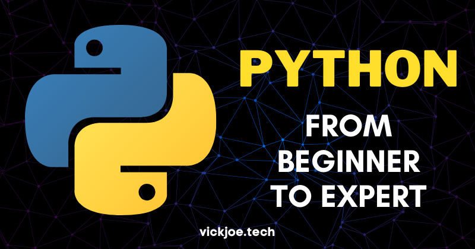
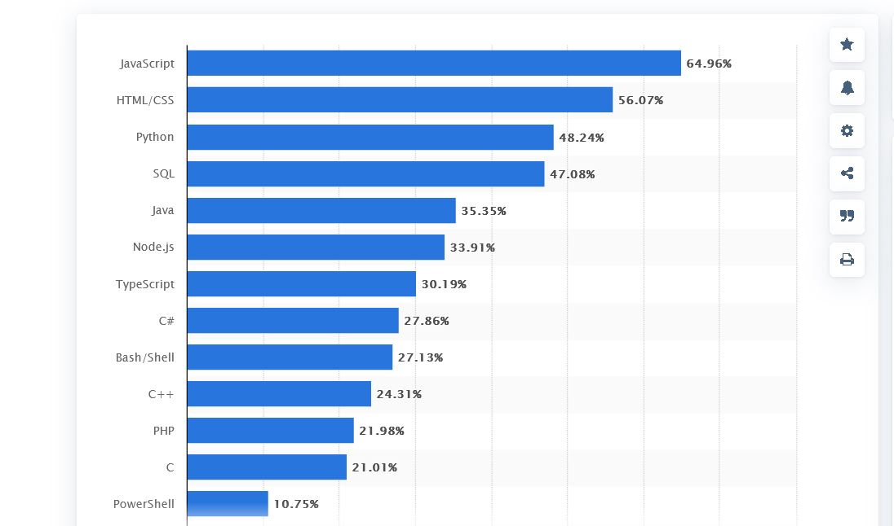

# Learn Python from Beginner level to expert

This is a comprehensive interactive python tutorial taking you from the basics to expert level.

Hello World,

## 🔑Reasons why you should be here

1. You ae an absolute beginner in python
2. You are new to programming and wants to make python your pathway.
3. You need a refresher course in python
4. Fix any other reason yo wish.

## 🤷‍♀️Why you should learn python

Here i wanted to start giving you motivation on why you should learn python 🙂. However, i decided against it, because for you to be here you are already aware of the **Power of Python** so i dont need to talk and demostrate much. For the sake of completeness, i will leave you with some few thoughs and encouragement.

According to Statista.com python ranks 3rd most used prigramming language nehind javascript and HTML, and ahead of Java. This proves that the lnaguage has gotten even more popular.

The popularity also comes in its usage. Python can be used in a wide range of things which includes:

- AI & Machine Learning
- Data Analysis
- Data Visualisation
- Programming Applications
- Web development etc.
It has wide range of applications. This is made possible by the various modules and packages (I will explain modules and packages below) available in python.

## 🛠️How to run this course

Irrespective of development platform you are working with, I have outlined easy ways for you to be able to make use of this course.

### Method 1 (Easy): GitPod 

GitPod is an opensource Kubernetes application for ready to code developers environment. This simply means that GitPod makes it look like you are working in your local environment whereas it is browser based. This works irrepective of your operating system.
Step1: Open in GitPod, create an account or sign in.
Step 2: Install Python Extention (This extension will help us run the python file)
Step 3: Run the files and follow through with the tutorials.

### Method 2 : Local Enviornment (VS Code)

Step 1: Install [VS Code](https://code.visualstudio.com/download)
Step 2: Install [Python](python.org)
Step 3: Install the following VS Code EXtensions
 a. Python
 b. Juypter
Step 4: Start running the .ipynb files.

They are several other methods to run a python notebook, but i trust you to discover the rest via google 😂.

## 😇How to use this course

 1. Start from the READ_ME to be able to understand the technical details of the course and how to run it.
 2. Either you click on 👉 or you proceed to lessons.
 3. After each lesson, do the exercise below it. This will ensure complete understanding of the subject matter.
 4. The lessons were organized in a step wise manner. This means that each lesson builds on top of the previous one, therefore it is advisible for you to take the lessons one after another.
 5. Give this repo a star ⭐ to add more visibility to it.

Continue to the [next Lesson](helllo), unless you want to read further.

## 🤝Contributing

You are free to contribute to this Repo through the following ways:

 1. Creating a Lesson
 2. Editing an already created lesson
 3. Correcting typographical errors
 4. etc.

You can do this by:

1. Creating an issue
2. Cloning the application
3. Adding your input.

📝 Make your changes in bits to enable simpler pull requests and faster merge.

Let's get started immediately.

